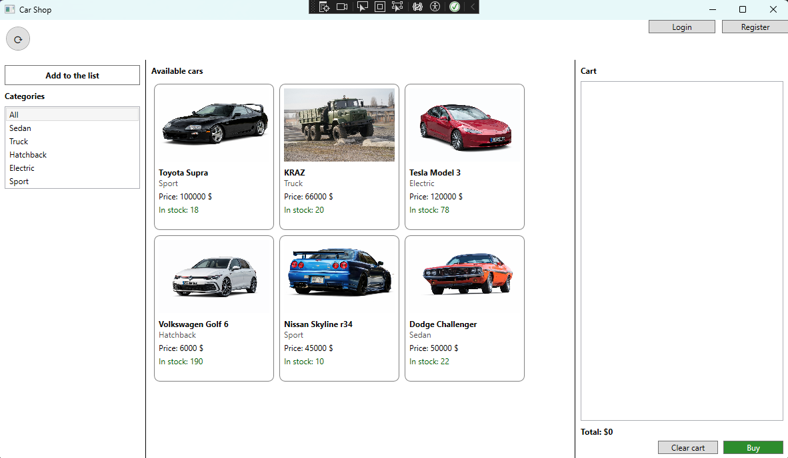

# ShopSeller

Hi! 👋

This is my student project built to practice **C#** and modern **.NET frameworks** through both desktop and web development.

## Project Overview

This repository contains two parts:

- **ShopSellerUltra** — a desktop car shop app built with **WPF**.
- **Web_Registration** — a web app built with **ASP.NET Core (Razor Pages)** for user registration and authentication.

## Main Features

### Desktop app (WPF)

- Browse available cars in a catalog view.
- Filter cars by category (for example: Sedan, Truck, Hatchback, Electric, Sport).
- View product details such as image, category, price, and stock.
- Add items to cart and view total price.
- Clear the cart or complete a purchase flow.
- Open login/registration windows for user actions.

### Web app (ASP.NET Core)

- User registration form with validation.
- User login endpoint/workflow.
- Basic API-style response models for auth operations.
- Service layer for database write/check logic.

## Technologies Used

- **C#**
- **.NET**
- **WPF (XAML)** for desktop UI
- **ASP.NET Core Razor Pages** for web UI
- **ASP.NET Core Web API/MVC components** (controllers, DTOs, services)
- **HTML/CSS/JavaScript** (web frontend)
- **Bootstrap + jQuery validation** (client-side web support)

## Interface Screenshot

## Note

This is a learning project, so some parts may be unfinished or simplified. Still, it has been a great hands-on step in learning C# and .NET development.
